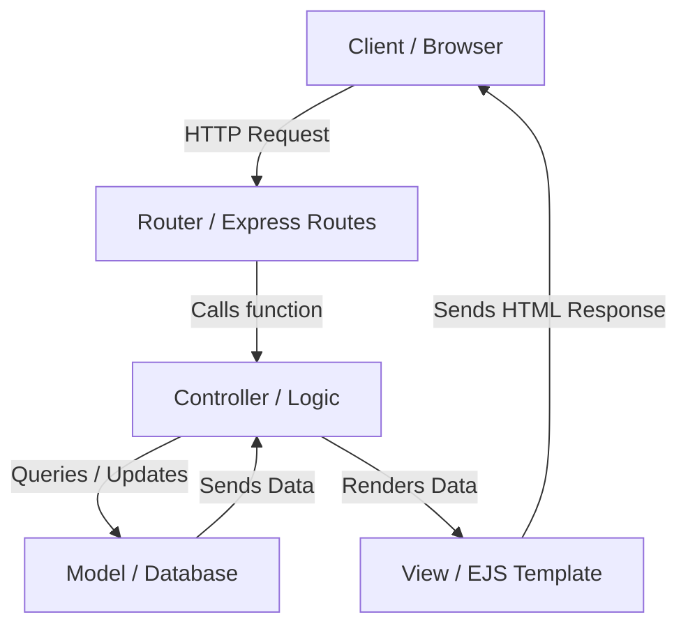

# Model-View-Controller (MVC) Architecture

The **Model-View-Controller (MVC)** is a software design pattern commonly used to develop user interfaces, databases, and application logic. It divides the related program logic into three interconnected elements to separate internal representations of information from the ways information is presented to and accepted from the user.

---

## 1. What is MVC?

*   **M - Model**: 
    *   Represents the data and database logic of the application.
    *   Defines database schemas, relationships, and validation constraints (e.g., using Mongoose).
    *   Directly manages the data, logic, and rules of the application.
*   **V - View**:
    *   Represents the user interface (UI) and design of the application.
    *   Used for displaying the data received from the Model via the Controller to the user.
    *   In our project, we use **EJS (Embedded JavaScript)** templates to render views dynamically.
*   **C - Controller**:
    *   Acts as the brain of the application, connecting the **Model** and the **View**.
    *   Contains the core business logic.
    *   Processes user requests (via routes), queries data from models, and renders the corresponding view or redirects to a different URL.

---

## 2. Project Directory Structure with MVC

To make the code modular, maintainable, and readable, our application is structured as follows:

```text
7.Project/
├── models/         <-- [MODEL] Database schemas (Listing, Review, User)
├── views/          <-- [VIEW] EJS templates (listings/, users/, etc.)
├── controllers/    <-- [CONTROLLER] Request handling & business logic (listings.js, users.js)
├── routes/         <-- [ROUTER] Maps URLs to Controllers (listing.js, user.js)
└── app.js          <-- Main application file
```

---

## 3. How MVC Works in our Code (Step-by-Step Flow)

1.  **Request**: The browser makes an HTTP request to a URL (e.g., `/signup`).
2.  **Router**: [routes/user.js](file:///c:/Users/Lenovo/OneDrive/Documents/Coding/Backend%20Apna%20College/7.Project/routes/user.js) intercepts the request and forwards it to the controller.
3.  **Controller**: [controllers/users.js](file:///c:/Users/Lenovo/OneDrive/Documents/Coding/Backend%20Apna%20College/7.Project/controllers/users.js) processes the request (queries DB if needed).
4.  **Model**: [models/user.js](file:///c:/Users/Lenovo/OneDrive/Documents/Coding/Backend%20Apna%20College/7.Project/models/user.js) performs database operations.
5.  **View**: The controller renders the EJS template (e.g., `users/signup.ejs`) and sends the HTML response back to the client.

### Visual Diagram:



---

## 4. Code Examples (Refactoring to MVC)

### Before (Without MVC Controller Separation)
Previously, the routing logic and request-handling logic were written together in the same file:

```javascript
// routes/user.js
router.get("/signup", (req, res) => {
    res.render("users/singup.ejs");
});
```

### After (With MVC Controller Separation)

1.  **Controller File**: Keeps routing files clean and holds all the logic.
    ```javascript
    // controllers/users.js
    module.exports.renderSignupForm = (req, res) => {
        res.render("users/singup.ejs");
    };
    ```

2.  **Router File**: Declares routes and points them to the controller functions.
    ```javascript
    // routes/user.js
    const userController = require("../controllers/users.js");

    router.get("/signup", userController.renderSignupForm);
    ```

---

## 5. Benefits of MVC

1.  **Separation of Concerns (SoC)**: Code is split by responsibility. Database queries stay in models, request logic in controllers, and layouts in views.
2.  **Maintainability**: If we need to change how a user registers, we only edit the `controllers/users.js` file, leaving routes untouched.
3.  **Reusability**: Different controllers can share the same database models.
4.  **Readability**: Files are smaller, cleaner, and organized.
